# Skin Estuary MOD V2 for KODI 19 Matrix KN Edition #

## Installation Notes ##

It's strongly recommended to install the skin via the "Kodinerds Repo", as this is the only way to guarantee that additional 
required modules (e.g. the PVR Artwork Module) are also installed. Another advantage is that you get automatic updates when 
you install an addon from a repository and not from ZIP.

To install the Kodinerds repository visit the page "https://repo.kodinerds.net", download the repository zip (red button) 
and install it. After that you can install the skin directly from the repository under "Look & Feel", "Skins".

### File name flagging ###
If you want to use special flags like HDR or Dolby Vision or special 3D formats you have to name your files with proper tags, 
preferably before the file extension: 

| 3D with   stereoscopic detection |           MVC codec            |          Side by Side          |         Top and Bottom         |    HDR Files*     |            HDR+ Files            |       Dolby Vision*       |
|:-----------------------------------:|:------------------------------:|:------------------------------:|:------------------------------:|:----------------------------:|:--------------------------------:|:------------------------------------:|
|          |  |  |  | 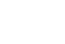 |  |  | 
|             no tagging              |             3d.mvc             |             3d.sbs             |             3d.tab             |        .hdr., .10bit.        |        .hdrplus., .12bit.        |     .dv., .dovi., .dolbyvision.      |

*Will be detected in Kodi Nexus and up and don't need filename tagging.

The HDR type recognition by filename will be removed if Kodi detects the HDR type itself properly.

### Animated Artwork ###

As the setup of animated artwork was done by skinhelper addon (which was removed from skin) the skin itself has now taken 
the management of those artwork. Animated artwork has some limitations (see Kodi Wiki: https://kodi.wiki/view/Artwork_types#Animated_Artwork). 
To get this feature work properly, you have to assign a folder within the skin settings, which contains all the artwork. This 
folder **must** be a folder of your local filesystem. Also you can use network share, which  **must** be mounted to a local mountpoint.
Put all your artwork into this folder. Subfolders are allowed (without nesting). 

If you navigate in your movie library, you'll have a new entry now to (re)assign animated Artwork in the context menu. The skin
supports animated poster only.

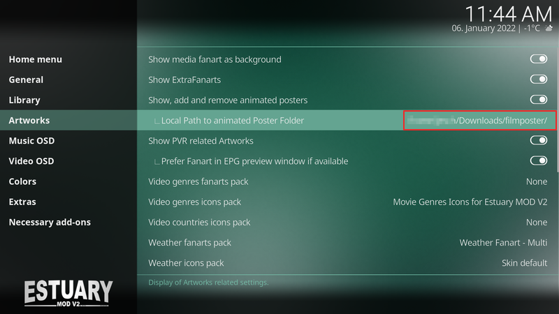
### 3.4.2+matrix ###
- .1
  * Transparency of label background of widgets (Flix view) customizable
  * semitransparent Background for plot in video info added
  * Overlay texture in Flix view changed
  * fix wrong behaviour on info button if a movie is paused.
  * reorder language ids above 40xxx to 31xxx and usages to fit within the recommended range for skins

- .0
  * Introducing Flix Landscape View

### 3.4.1+matrix ###
- .8
  * fix text adjustment in settings
  * fix incorrect shown clearlogo
  * set "show cast list" as general option in video info
  * introducing ISO flag as source flag

- .7
  * Dutch + Hungarian language updated (many thanks to Klojum and frodo19)
  * some adjustments
  * introducing Font Economica 

- .6
  * Fix cast aspect ratio for 21:9 displays
  * Improved Next Popup for TV-Shows

- .5
  * Bugfix Video OSD
  * Radio Channel Groups in Home Menu added
  * settings button from music info removed
  * special settings for artists, extra fanart and discography removed

- .4
  * Texture update
  * Movie set Info fixed  
  * Category 'PVR & Live TV' in skin settings added
  * changeable list height for channel and program OSD implemented

- .3
  * Bugfix in Variables.xml

- .2
  * Improved OSD animations (reduce flickering slides)
  * Icon Powerdown/Timer added (active addon "Recording & Power Manager - RPM")
  * OSD PVR flag added if broadcast is available in local file system
  * Background for PVR channel icons added

- .1
  * use sort order of upcoming next episodes from embuary skinhelper addon
  * move decorator background of video preview from epg window into background
  * Fix bug on skin settings is unchangeable if a setting met no language string when language has changed.

- .0
  * improved Channel Guide OSD, Channel OSD
  * missing HDR label on Live-TV (PVR) added
  * Record flag added

### 3.4.0+matrix ###
- .14
  * Settings option for displaying current time/total time and time remaining in small video OSD
  * File view in video widgets added (movie, tvshow)
  

- .13
  * color scheme 'chicken' added
  * UK/MPAA 15 rating added
  

- .12
  * fixed incorrect poster overlays in episode view
  * some icons added
  * Media flag gap closed if video codec is missing
  * Background pattern added
  * fixed missing content path for movie genres
  * some PVR Radio fixes

- .11
  * Missing control 1501 in CoreELEC/LibreELEC Settings Wizard added
  * Condition for Palm Week fixed

- .10
  * Russian language updated, thanks to aleksslab
  * Navigation in PVRGuide optimized

- .9
  * Player process window in small osd adjusted
  * List settings button in DialogVideoInfo removed
  * Option for showing artist list in skin settings added
  * Fixed issue with missing widget titles
  * Albums count from widget templates removed
  * Missing language strings (GER) for rating colors added
  * some modifications on holiday themes, Palm Week colors added

- .8
  * Remove detection and use of extrafanart folder, as this isn't used by addons anymore
  * Remove fanart section from DialogVideoInfo and DialogMusicInfo
  * small changes to skinshortcut template (loading menues up to 100% faster), many thanks to beatmasterRS
  * add bookmarks button to simplified video osd

- .7
  * Remove dependencies of Embuary Helper/Script from addon.xml
  * Add dependencies of Embuary Helper/Script to "needed Addons" in skin settings
  * Fixes on PVR channel status visibility and media menu in several channel views
  * Player process info extended (thanks to crazyturk who pointed this out)

- .6
  * PVR: extended channel list fixed (missing item)
  * Skin errors in logfile fixed
  * missing spaces in some labels (PVR related) inserted (Issue #46)
  * Option for disable/enable PVR channel status symbols (recording/playing/encrypted/etc) added

- .5
  * PVR Guide Control quick fix

- .4
  * Colored flags updated (thanks again to frodo19)
  * smaller modifications on several PVR/OSD views
  * Guide navigation window added
  * Movieset View fixed

 
- .3
  * Video OSD: button 'switch to last channel' added
  * new view 'Big List' in PVR channel added

- .2
  * Adjustments/Fixes in several views (mainly music section)
  * missing help text on empty libraries and disc menu are back
  * animated artwork on movie sets are now visible

- .1
  * Missing addon dependencies in skin settings added
  * Infolabels for SIG/SNR changed (PVR)

- .0  
  * PVR Artwork context menu removed
  * Animated Artwork context menu removed
  * Script service.py modified (all parts of PVR Artwork, animated Artwork removed)
  * Dependency to PVR Artwork Module bumped to 2.0.0
  * new audio-, subtitle and PVR flags
  * minor modification of small OSD menu

### 3.3.1+matrix ###
- .4  
  * shortfix for MPAA detection and displaying

- .3
  * improved MPAA detection and handling
  * improved OSD menu (thanks to Solo0815)
  * minor fixes
  * several language file updates (thanks to all contributors)

- .2 
  * Bug fixed for deleting animated artwork of TV Shows
  * Reimplemented Home button for DVD/BR menus in Video OSD
  * Audio toggle button in OSD video menu implemented
  * Introducing simplyfied OSD menu (Netflix style)

- .1
  * Hungarian language updated
  * Dutch (Netherland) language updated
  * Italian language added (many thanks to thedoctor66)
  * animated artwork detection for TV Shows extended
  * chapter marks in Video OSD added
  * Support for Rotten Tomatoes/MetaCritc added (mediaflags)
  * some smaller fixes/changes

- .0 
  * Contextmenu entry and associated script for (re)assigning animated posters of movies added

### 3.3.0+matrix ###
- .15
  * Recognition for Dolby Vision changed from .dovu. to .dovi.
  * optimized breadcrumbs in list views, visibility is now switchable/costumable 
  * Seasonal themes for 2022 updated (Valentine: 14.02, Easter: 14-18.04, Halloween: 31.10, Christmas: 27.11 - 26.12)

- .14
  * Recognition for Dolby Vision extended (.dovu., .dolbyvision.) 
  * Coloured media flags added, thanks again to frodo19 
  * Hungarian language added, many thanks to frodo19
  * Recognition of 3D Files partial changed

- .13
  * add missing HDR/HDR+/DV labels in video OSD
  * add item counter in list view / extended list view
  * split 3D Labels into 3D.mvc, 3D.sbs and 3D.tab (needs file name tagging like: 3d.mvc, 3d.sbs, 3d.tab, 3d)
  

- .12
  * expand label size of options label (was cutted)
  * seasonal colored buttons for video-/audio OSD implemented

- .11
  * another Bug in PVR artwork service fixed
  * revert mosaic wall views and widget view for musicvideos if poster view for widget was not choosen
  * move addon widget "German Telecast Offers" to the top of PVR widget page
  * addon "Artist Slideshow" to the list of recommended addons added
  * some typos in language files corrected
  * missing language strings in german language file added, unused strings removed
  * make rewind/forward button of player controls visible if a stream is seekable

- .10
  * Bug in PVR artwork service fixed

- .9
  * Missing mono font added (thanks dshoreman)
  * NL language updated (thanks freaktabnl)
  * services script revised, PVR Artwork Module (script.module.pvr.artwork) version > 1.0.17 needed

- .8
  * Including PVR archive & reminder icons (thanks berkhornet)

- .7
  * Introducing SACD (DSD) audio flag
  * minor improvements

- .6
  * Parental controls removed (use profiles and lock mechanism instead)
  * Fix conditional behaviours on movie/tvshow widgets
  * minor adjustments in various dialogs and views

- .5
  * optional display of channel logo/number in epg grid implemented
  * Changes in picture widget reversed

- .4
  * Costum settings widgets views revised
  * Selection for default action on movie and TV show widgets implemented
  * smaller fixes and enhancements

- .3
  * Autoclose OSD Fix

- .2
  * Code cleanups and small fixes
  * Date Aired Flag added (Movies/TV Shows)

- .1
  * Fix some issues when starting movie trailers from Embuary Info

- .0  
  * Fix in Shutdown Menu: correct distribution logo was not shown
  * Full integration and customization of Embuary Info windows into the skin
  * Improvements on widget info visibility (PVR)
  * Video OSD with adjustable timing on auto close

### 3.2.0+matrix ###
- .8
  * Fix in Shutdown Menu: correct distribution logo was not shown

- .7
  * Fix in List View (Posters was not shown)

- .6
  * Introducing media flags for video color depths like HDR (10bit), HDR+ (12bit) and Dolby Vision        by identifying special parts within filenames (.hdr., .10bit., .hdrplus., .12bit., .dv.)
  * Better implementation of embuary info script in Video Info Window and OSD Info
 

- .5
  * Bugfix: MPAA rating not showing in movie collections
  * Minor bugfixes

- .4
  * Reimplementation of extended info button in video OSD and native call to embuary info script

- .3
  * Introducing MPAA/TV media flags
  * Bug fixed in music visualization (PVR radio)

- .2
  * Improved Addon settings window (thanks @realvito from kodinerds)

- .1
  * Revert some cleanups of includes
  * Texture updates, PVR category improvements part #2
  * Improvements/Bugfix in PVR artwork section

- .0
  * Extended Info (embuary helper) in tvshow and movie info window added
  * Implementation of PVR category widget improved (addon German Telecast Offers)
  * TV show widget next aired episodes implemented
  * conditional visibility of media flags in info windows fixed

### 3.1.0+matrix ###
- .7
  * Some more labels from PVR artwork module in PVR info window added
  * Reimplementation of studio icons in PVR info view (studio icons white required)
  * Some smaller fixes

- .6
  * Fix missing semitransparent backgrounds on some PVR related windows
  * Fix missing action of info button in PVR OSD menu

- .5
  * Busy spinner for PVR artwork in several PVR views added
  * NL language file updated

- .4
  * Selection between fanart/poster view in EPG preview window, busy spinner added
  * bigger preview picture in EPG timeline, timeline items reduced from 8 to 7 lines
  * NL language strings updated
  * Dependency of TV show next aired addon removed from addon list and code

- .3
  * Introduction and Bugfix of normal/extended Power Menu
  * further improvements of PVR artwork functions

- .2
  * Improvements/Bugfixes of PVR artwork functions and info window

- .1
  * show distribution/standard logo in top left corner
  * modification/rearranging of date/time info
  

- .0
  * Implementation and introduction of PVR artwork using the "PVR Artwork Module"
  * show date in top bar (optional)

### 3.0.9+matrix ###
- .0
  * PVR NextUp notification window improved
  * NL language strings updated
  * Rewrite and reimplementation of forced views

### 3.0.8+matrix ###
- .7  
  * Empty space on TV Widget removed if current/next recordings are deselected from widget menu but current and/or next schedules are present
  * Bool condition of visibility for option "Reboot from NAND" in shutdown menu removed
  * Addon-Id info added (Addon Information window)
  * PVR NextUp notification fixed
  

- .6
  * 'Kodi restart' button implemented (Power menu)
  * Shift View for pictures fixed
  

- .5  
  * Background images for power menu, settings menu and search menu reimplemented
  * Rules of background images redefined
  

- .4 
  * "Up Next" double strings notifications fixed, many thanks to hawkeyexp
  * viewswitcher script temporarily deactivated as this cause some issues  

- .3
  * Some language strings updated

- .2
  * Relaunch weather fanart on main screen and selected weather widget
  * Fanart view fixed
  * Several music and concert views fixed
  * Reboot to NAND option in shutdown menu added
  * Some conditions of selecting artworks on music visualization changed (experimental)
  * Minor fixes
  
  
- .1
  * Display of publication year of movies/videos/tv shows in titles is now switchable
  * Dutch translation added, thanks to "theghostnl" from Kodi forum
  

- .0
  * "Add" Button in Default Dialog Select Window reimplemented

  
Note: In my opinion, the adaptation to Kodi 19 is complete. Future changes will only be bug fixes, as far as I am able to do  it.

### 3.0.7+matrix ###
- .16 
  * Bugfix: missing settings window of skin shortcuts addon reimplemented
  * Addon dependencies updated

  
- .15 
  * Portuguese (Brazil) translation added, many thanks to Fábio Vieitas Marques
  * Visibility of border and border color of radio and stream covers now dependend to border settings in skin setup, this allows shaped station logos

- .14
  * Media selection for splash screen removed (causes crashes on startup sometimes)
  * Introducing addon "Sleepy Watchdog" as sleeptimer in shutdown menu
  * Fix of banner and artist clearart positions in music views if they both enabled at same time
  * Clearlogo on main music views removed (when overlapping other items)
  

- .13
  * Rewrite of function "Jump to letter"
  * Option for API key management in settings removed
  * Behavior of widelist animation fixed if online content was requested
  

- .12
  * last added episodes widget fixed if no thumbnail is available
  * Expression for easter theme updated (2.04 - 5.04), missing runtime values in info views added
  
  
- .11
  * Library editor changed against Metadata editor (settings window)
  * Backup/Restore items from settings removed (use Backup Tools instead)
  * Some graphics changed
    

- .10
  * Dependencies of script.artwork.helper removed
  * Rework of animated background (Fanart)

    
- .9
  * Clearlogo from home screen and several main views removed (when overlays other items)
  * Settings window updated (required and optional addons)
  * Artwork Dump instead of Artwork Helper (n.a. for Matrix) implemented

- .8
  * Triple list fixed

- .7        
  * Mosaic view fixed, next unseen episodes reimplemented, start implementation of embuary helper

- .5
  * Dependencies of script.skinhelper service completely removed

### Screenshots ###

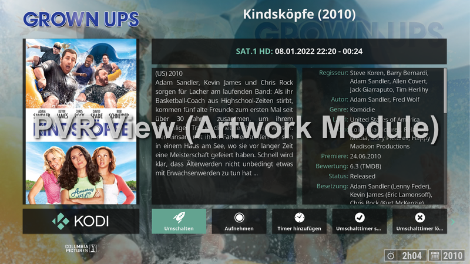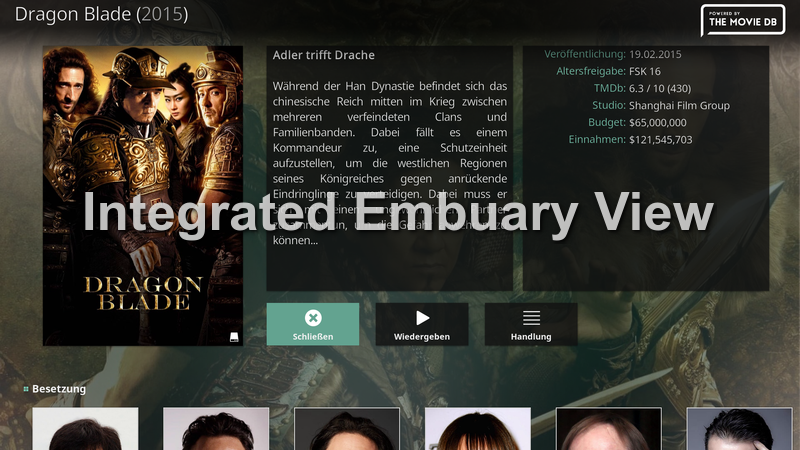
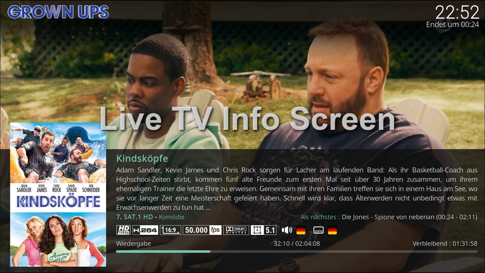
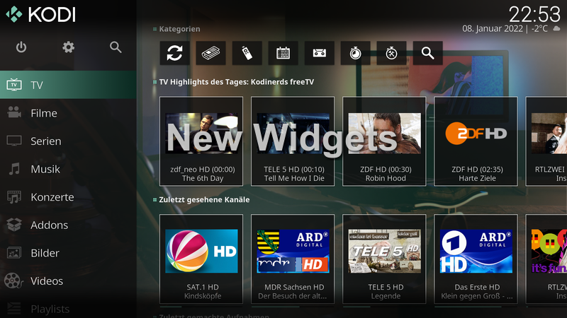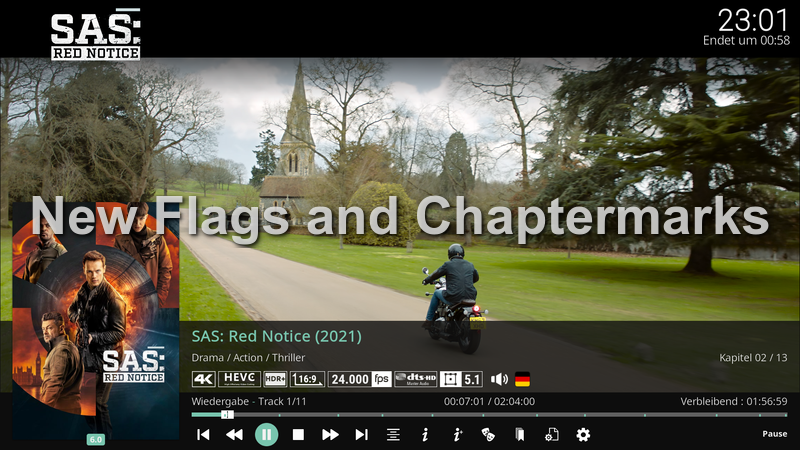
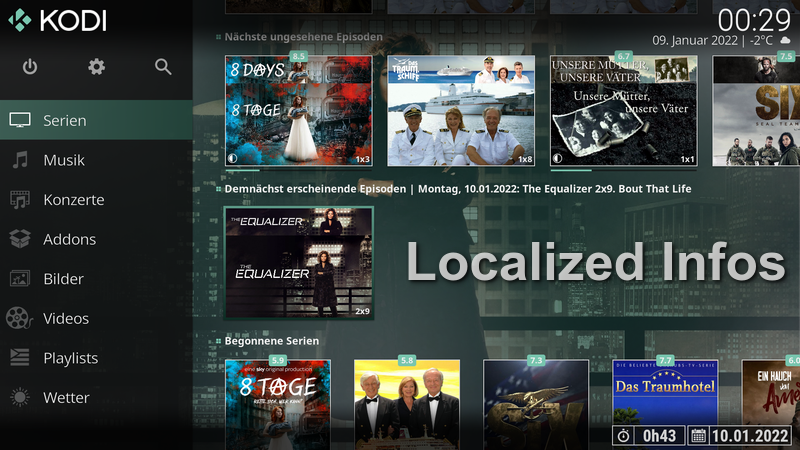
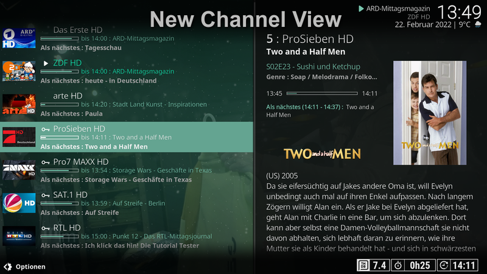
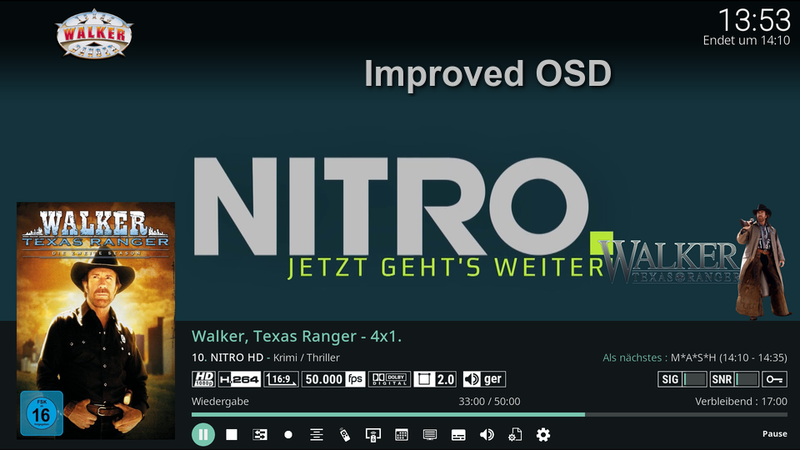
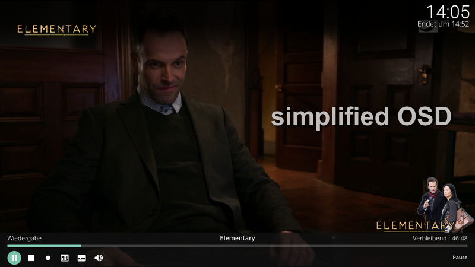
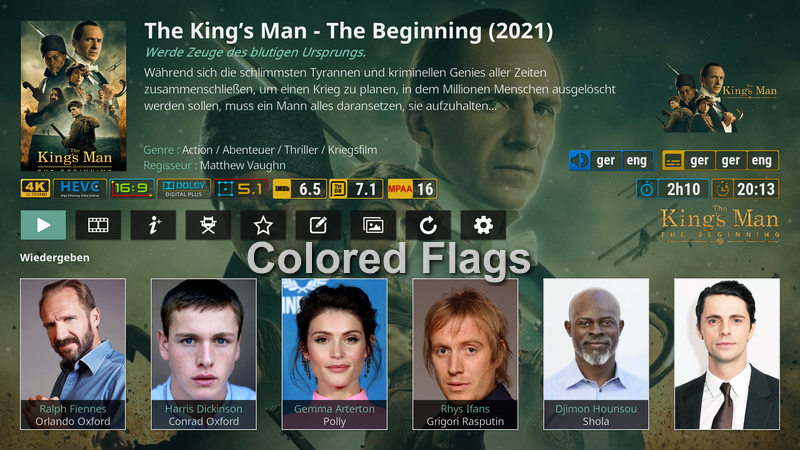
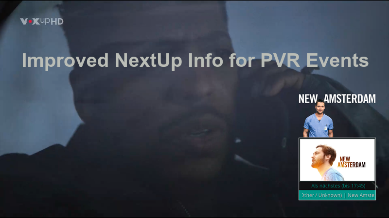
