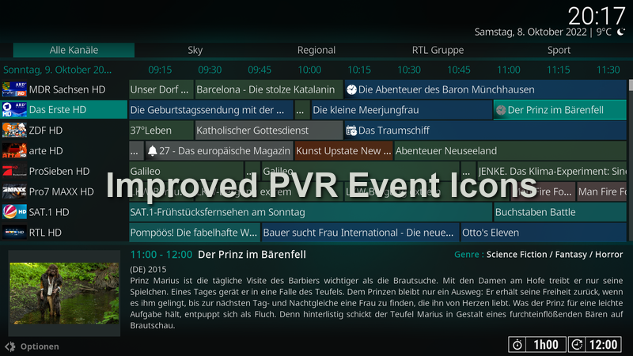
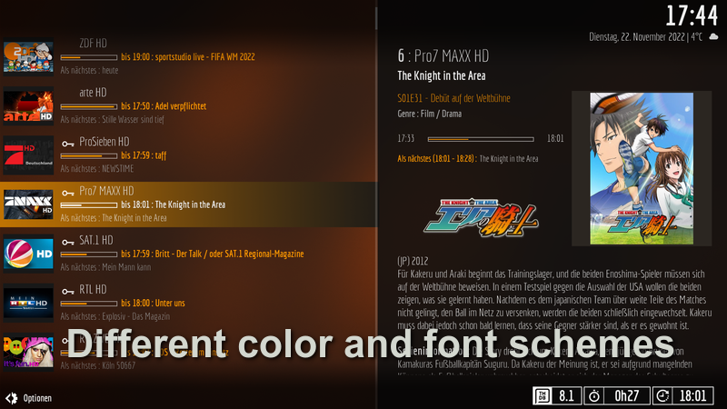
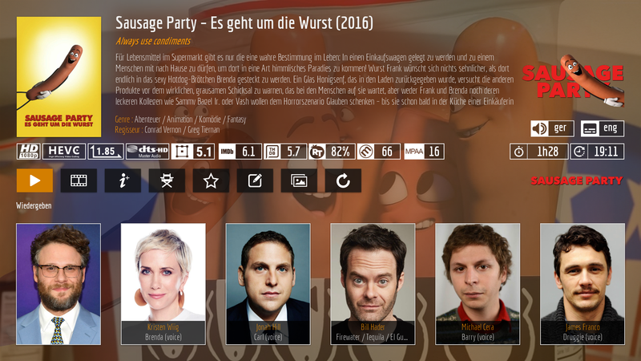
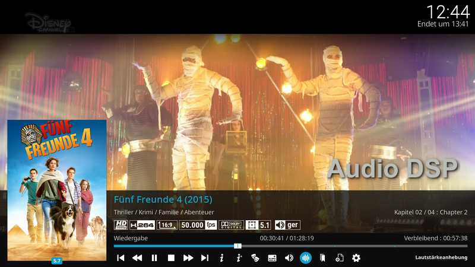
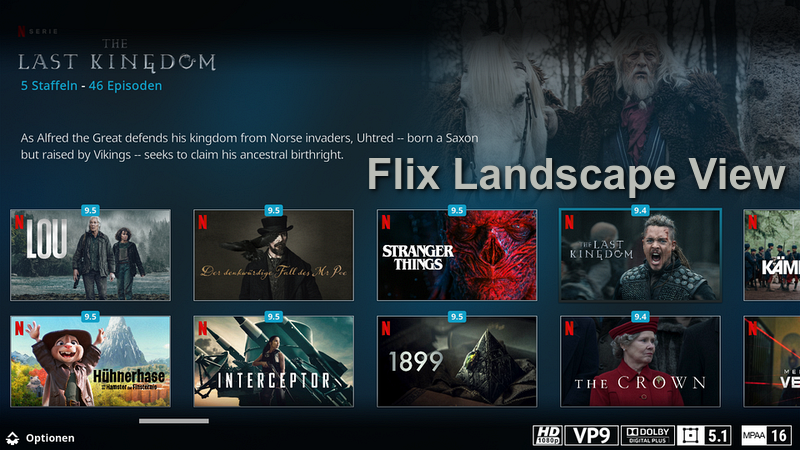

# Skin Estuary MOD V2 for KODI 21 Omega KN Edition #

**Some screenshots You'll find at the end of this Readme**

## Installation Notes ##

It's strongly recommended to install the skin via the "Kodinerds Repo", as this is the only way to guarantee that additional 
required modules (e.g. the PVR Artwork Module) are also installed. Another advantage is that you get automatic updates when 
you install an addon from a repository and not from ZIP.

To install the Kodinerds repository visit the page "https://repo.kodinerds.net", download the repository zip (red button) 
and install it. After that you can install the skin directly from the repository under "Look & Feel", "Skins".

## Installation from Git ##

If you want to install the latest version from Git (before this has added to Kodinerds Repo) just download the Addon from here 
https://github.com/b-jesch/skin.estuary.modv2/tree/Omega (green Code button), **rename the root folder inside the ZIP** 
from ```skin.estuary.modv2-Omega``` to ```skin.estuary.modv2``` and choose 'install from zip' inside Kodi. **Renaming 
the root folder inside the ZIP needs unpacking/packing the zip in some cases.**

### File name flagging ###
If you want to use special flags like HDR or Dolby Vision or special 3D formats you have to name your files with proper tags, 
preferably before the file extension: 

| 3D with <br> stereoscopic detection |           MVC codec            |          Side by Side          |         Top and Bottom         |            HDR+ Files            |
|:-----------------------------------:|:------------------------------:|:------------------------------:|:------------------------------:|:--------------------------------:|
|          |  |  |  |  | 
|             no tagging              |             3d.mvc             |             3d.sbs             |             3d.tab             |        hdrplus., .12bit.         |


The HDR type recognition by filename for HDR/HLG/Dolby Vision has been removed.

### Animated Artwork ###

As the setup of animated artwork was done by skinhelper addon (which was removed from skin) the addon "Animated Artwork Module" has now taken 
the management of those artwork. Animated artwork has some limitations (see Kodi Wiki: https://kodi.wiki/view/Artwork_types#Animated_Artwork). 
To get this feature work properly, you have to assign a folder within the addon settings, which contains all the artwork. This 
folder **must** be a folder of your local filesystem. You can use network share, but this **must** be mounted to a local mountpoint.
Put all your artwork into this folder. Subfolders are allowed (without nesting).  

If you navigate in your movie library, you'll have a new entry now to (re)assign animated Artwork in the context menu. The skin
supports animated poster only.


### 21.1.0+omega ###
- .1
  * Flag "added to library" added
  * Bug in video OSD fixed
  * smaller code changes
 

- .0
  * Media flags completely revised (uniform size and improved common code basis)
  * missing music info on radio broadcasts fixed


### 21.0.0+omega ###
- .9 
  * some icons added
  * Code Improvements on full video OSD
  * OSD media flags fixed/improved
  * remove switching channel options (PVR)
  * Option added for hiding SIG/SNR flags if not provided by Backend Driver (returns always zero)


- .8
  * fix several position adjustments on small Video OSD
  * add PVR device number flag if PVR stream device has numbered (#x) labels
  

- .7
  * remove obsolete DialogFavourites.xml
  * fade out extended progress bar when music visualisation is active
  * some seasonal backgrounds changed
  * add more busy spinners
  * add missing font definition
  

- .6
  * show PVR SIG and SNR flags only when LiveTV or Radio is playing
  * add "More" folder for dynamic content containers (home screen)
  * fix pvr targets in home screen widgets


- .5
  * added several busy spinners
  * update deprecated player info
  * improved OSD code grouping, replace filenames with window names


- .4
  * revert back extra info on cast list
  * fix wrong actors list showing on movies with same titles but different year   
  * add Internet Connection Status to Home screen
  * Merge PR #130 (disappearing side panel on busy spinner)
  * add custom colors to battery level indicator (selectable via skin settings)
  * customize text shadow color in skin settings
  * improvements in embuary dialogs
  * introducing time display selection on music OSD/Skin settings
  * fix navigation issues on several OSD dialogs
  * introducing new dynamic default CD cover (music OSD)
  * introducing speed in-/decrease buttons in video OSD


- .3
  * improved scrollbars
  * add title and year info to wall view items
  * disable autoclose OSD when touchmode is selected
  * improved background image handling (issue #128) 


- .2
  * add support for PreShowExperience
  * add TV Show count/seen/unseen to settings shortcut widget
  * improved actors list in video info

- .1
  * Introducing battery level indicator
  * Update Player Process Info (again thanks to frodo19)
  * Move Chapter/Cutmarkers to seekbar
  * Option "Hide notifications while Playback" removed
  * Fix missing video genre fanart even if fanart pack is installed
  * add runtime (duration) to PVR search results, minor improvements
  * add a resume button to video info (DialogVideoInfo.xml)


- .0
  * initial commit
  * add animation to PVR NextUp
  * reverted image type back to multiimage for weather widget

 
### Screenshots ###







